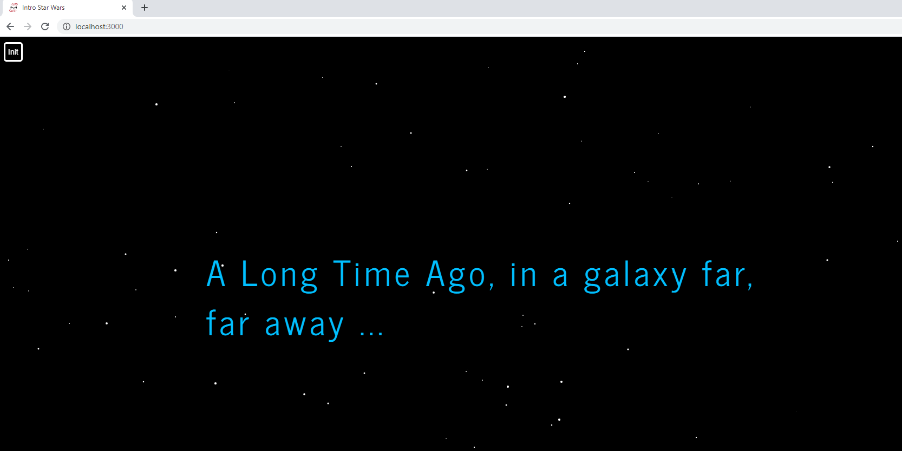

# starwars-intro
Star Wars film intro animation developed in HTML, CSS, JavaScript and Node.js (Tutorial by glaucia86 - https://bit.ly/32UG73k)

## Technologies :computer:

* **[Nodejs](https://nodejs.org/en/)**
* **[Express.js](https://expressjs.com/)**
* **[Eslint](https://eslint.org/)**
* **[Prettier](https://prettier.io/)**
* **[Heroku](https://www.heroku.com/)**

## Build Setup

    # install dependencies
    npm install
    
## Running the app
    
    # running with nodemon
    nodemon
    
    # running with Node
    npm run start

## Production :rocket:

https://starwarsintro-mari.herokuapp.com/
